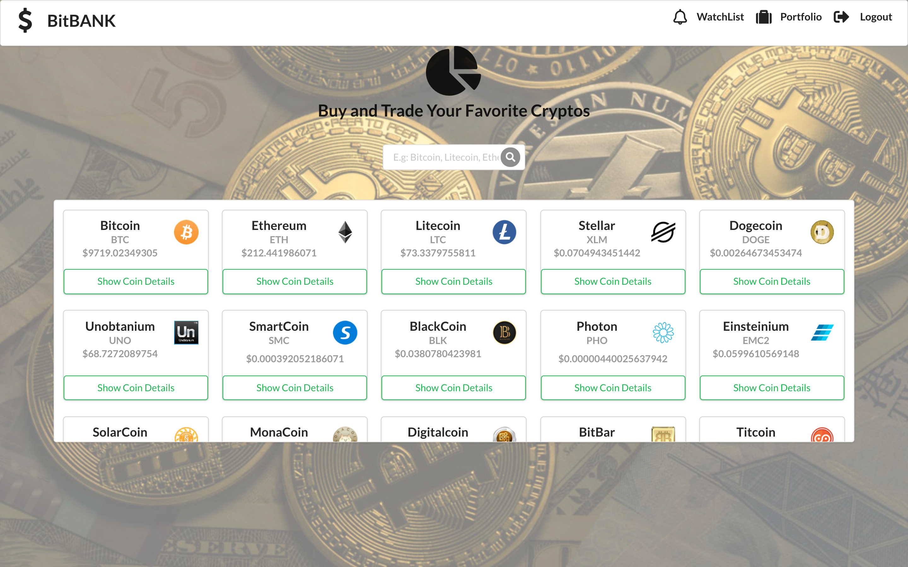
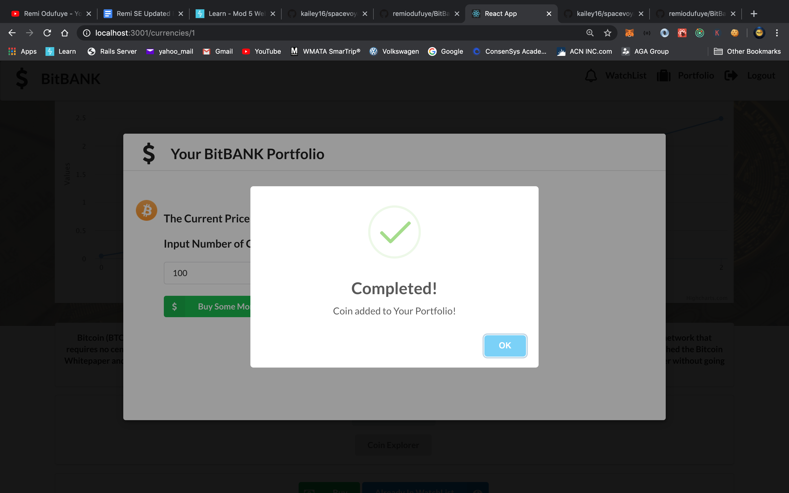
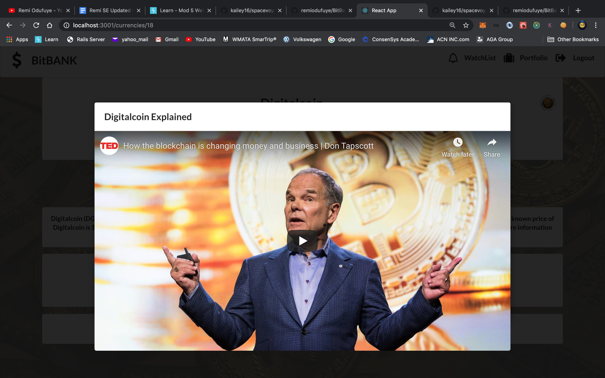

## BitBank frontend
BitBank is an application built to help people Watch , Buy and Learn More About Crypto Currencies .

### This is a repository for BitBank's frontend:
  - designed with React JS
  - Used Redux to Manage State 
  - styled with Semantic UI framework and custom CSS
  - dynamically communicating with Rails APIs by fetching to the backend
  
### To start the whole application, please clone both of BitBank-backend and BitBank-frontend
You can find Backend at: https://github.com/remiodufuye/BitBank_BackEnd

## To start this frontend repository:
  1. open and run 'npm install'
  2. run 'npm start' 
 

 ### To see a full demo, please look at: https://youtu.be/0RziSXZZ8bk
   
